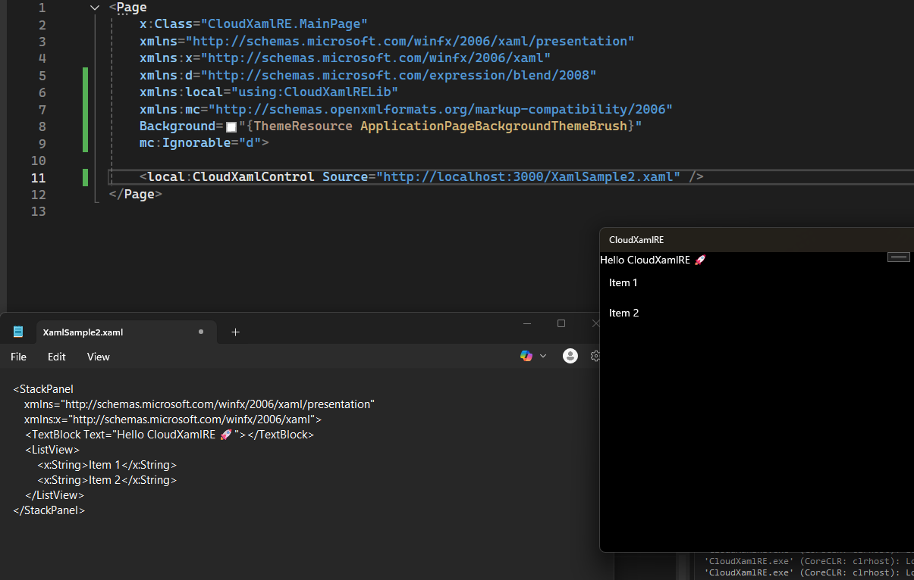

# CloudXamlRE
Deliver XAML right from the cloud directly to your device, fully rendered 

  

## Limitations (as per Microsoft Docs):

- The XAML content string must define a single root element.

- The XAML content string must be well-formed XML, as well as being valid XAML.

- The XAML content must define a default xmlns. Typically this is the Windows Runtime XAML vocabulary, as identified by http://schemas.microsoft.com/winfx/2006/xaml/presentation.

- Any custom assemblies referenced in a XAML namespace mapping must already be available to the application.

- The XAML should not attempt to specify x:Class attribute, or include any XAML-defined attributes for event handlers.

- You can't use FindName in the general XAML namescope to find a runtime object added, but you can search within the specific XAML namescope of the object created. For more info, see XAML namescopes.

- Object creation logic cannot integrate the loaded XAML with code-behind classes at run time. If you want to add event handlers, you must do so in code by referencing objects obtained from within the object tree structure of the Load result, and using language-specific syntax for attaching handlers (such as +=).

- There must be existing XAML content; you cannot replace the entire tree of content. You must at the very least preserve the original root element so that the app model implications of a loaded XAML page remain active.

- The object that is created from Load can be assigned to only one location in the primary object tree. If you want to add objects created from identical XAML to different areas of the application's primary object tree, you must parse the XAML multiple times using the same input string, using different destinations for the return value.

- The primary object tree remaining must support an appropriate property to set.

Reference: [Microsoft Docs](https://learn.microsoft.com/en-us/uwp/api/windows.ui.xaml.markup.xamlreader?view=winrt-26100)